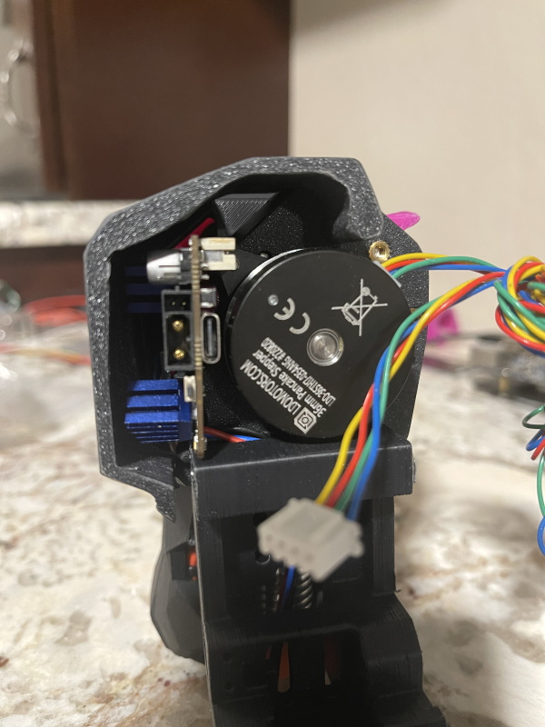

# Voron 2.4 A Drive Modified Cable Cover with PG7 Mount

So, you have gone full CAN bus and you want to mount a PG7 cable gland on the A Drive? This is an extended version of the standard cable cover with M12 threads. 

This cover retains the alignment with the standard wiring of a V2.4. It's exactly 5mm taller and prints like the original.

# Voron 2.4 Umbilical Support

Want to hang that cable up high? Well this is my take at a support for the cable. 

# Stealthburner Electronics door for SB2040

Got one of the new Mellow SB2040's? Well the cable door stock doesn't fit very well. This mod isn't the prettiest in the world but it shure gets the job done.

* modified recently to add more space for a heatsink on the stepper driver.

And for those who like cad models...

