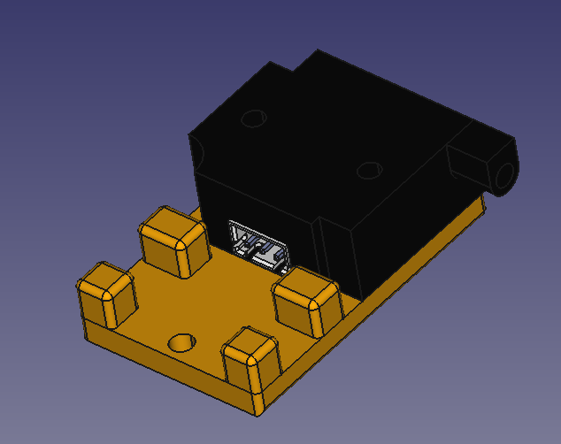

# Voron Filament Sensor Mount

Using one of the standard pre-made microswitch-based filament sensors, this mount attaches typically before the bowden support.

# Bill of Materials (BOM)

Tools:

- Soldering Iron for the heat inserts

Filament mount:

- 1x M3x8  mm
- 1x M3 t-nut or equivalent

Fixed sensor mount:

- 2x M3 heat set insert
- 2x M3x16 mm

# Assembly

## Step 1 - Filament Sensor Mount

For the filament sensor mount you need the following parts:

- [ ] 2x M3 heat set insert

Install your heat set threaded inserts using the soldering iron or your preferred tool. Place the inserts on the bottom of the mount so if there is protrusion they will come out the top

## Step 2: Filament Sensor Assembly

For the filament sensor assembly you need the following parts:

- [ ] 2x M3x16mm

Insert the screws through the filament sensor ensuring the orientation of the sensor is as shown in the picture above.

## Step 3: Filament Sensor Assembly

For the completed filament sensor assembly you need the following parts:

- 1x M3x8  mm
- 1x M3 t-nut or equivalent

Insert the M3x8 mm screw through the top and attach the t-nut to the bottom. Install on the frame a couple of inches (50mm) or more from the bowden tube support.
